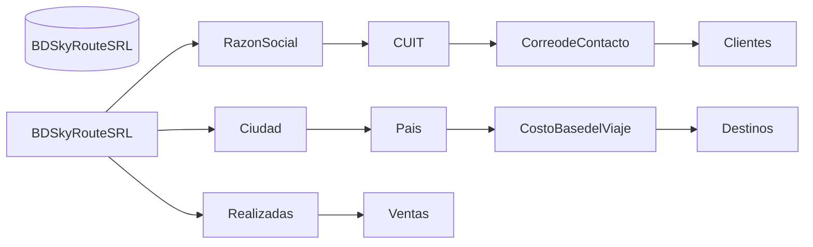

```mermaid
graph LR;
  ordersDB[(BDSkyRouteSRL)]
  BDSkyRouteSRL-->RazonSocial;
  BDSkyRouteSRL-->Ciudad
  BDSkyRouteSRL-->Realizadas
  RazonSocial-->CUIT;
  CUIT-->CorreodeContacto;
  CorreodeContacto-->Clientes;
  Ciudad-->Pais;
  Pais-->CostoBasedelViaje;
  CostoBasedelViaje-->Destinos;
  Realizadas-->Ventas;
```
