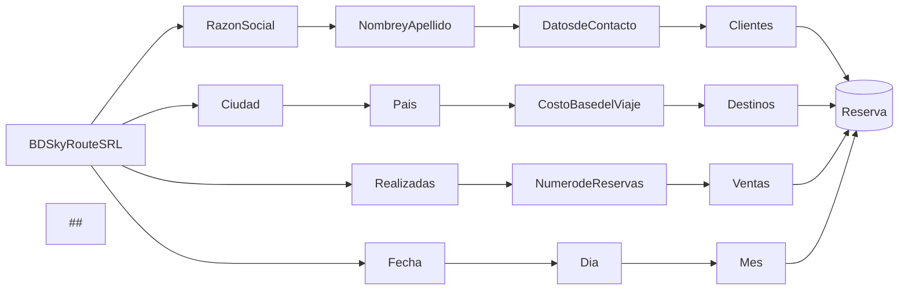

```mermaid
graph LR;
  ordersDB[(Reserva)]
  BDSkyRouteSRL-->RazonSocial;
RazonSocial-->NombreyApellido
  NombreyApellido-->DatosdeContacto;
  DatosdeContacto-->Clientes;
  Clientes-->ordersDB;
##
  BDSkyRouteSRL-->Ciudad
  Ciudad-->Pais;
  Pais-->CostoBasedelViaje;
  CostoBasedelViaje-->Destinos;
  Destinos-->ordersDB;
##
  BDSkyRouteSRL-->Realizadas
  Realizadas-->NumerodeReservas
  NumerodeReservas-->Ventas;
  Ventas-->ordersDB;
  BDSkyRouteSRL-->Fecha;
  Fecha-->Dia;
  Dia-->Mes;
  Mes-->ordersDB;
```
